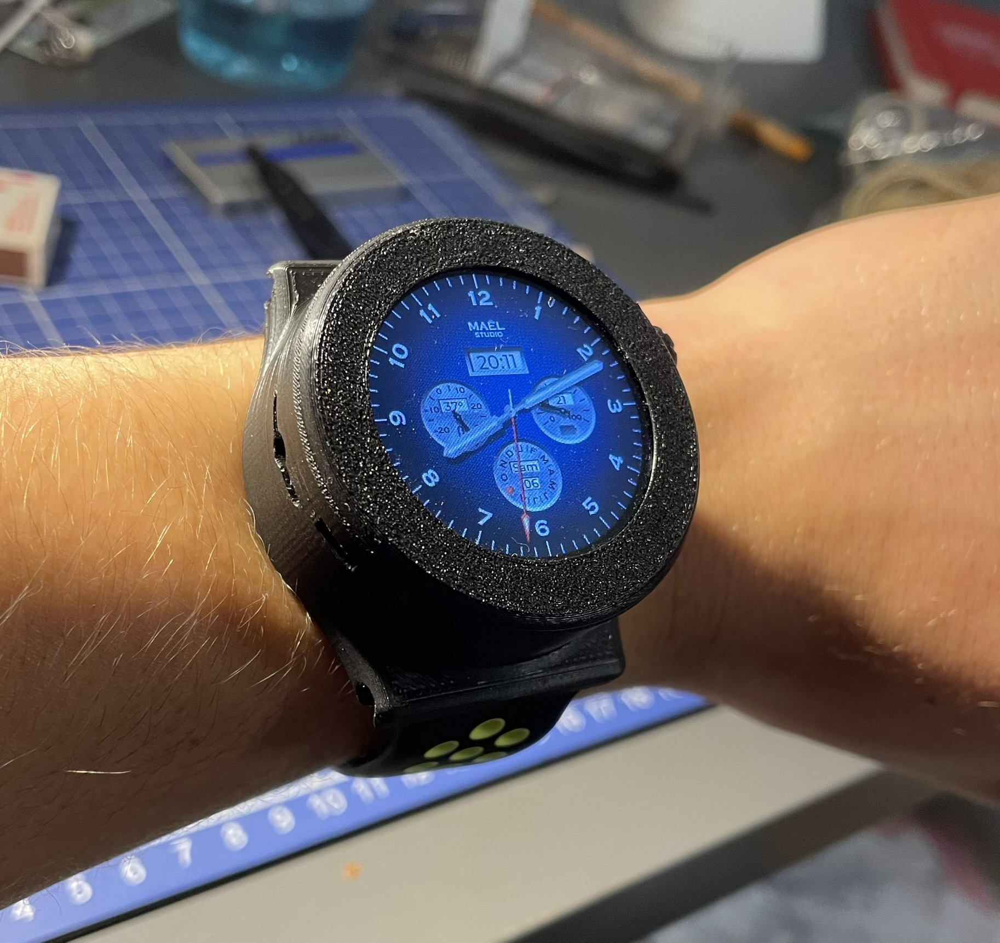
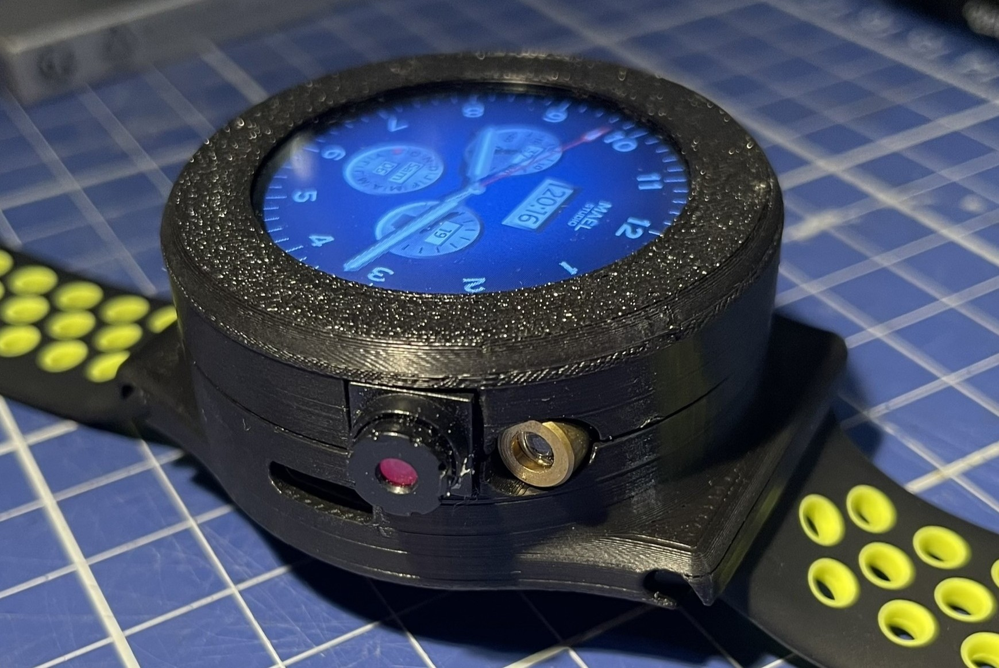
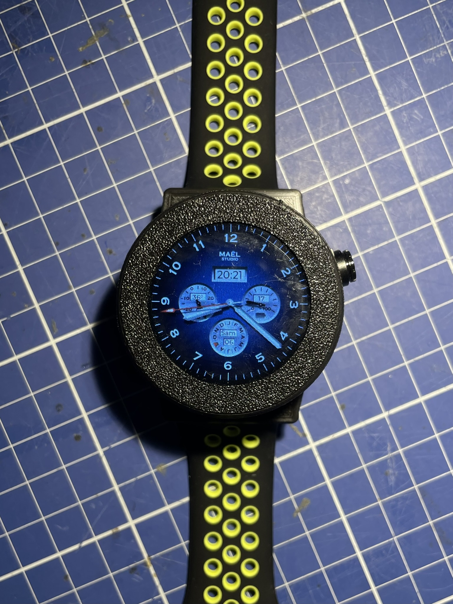
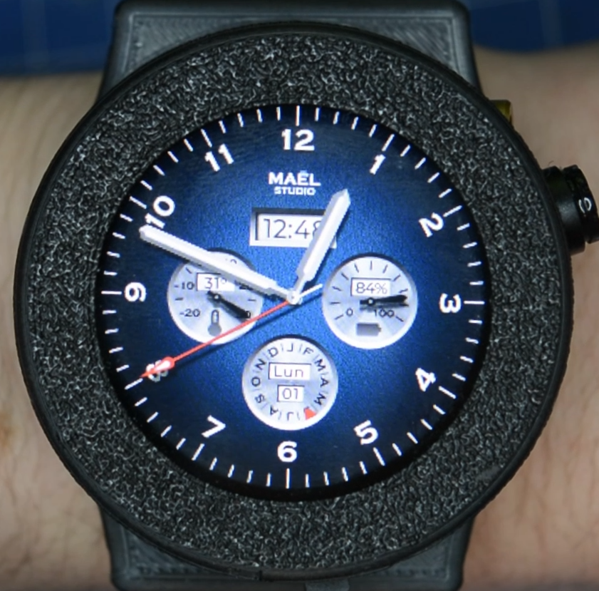

# maelstudiOS 1.0

Logiciel pour ma montre intelligente ESP32.

Bibliothèque graphique utilisée: [LVGL](https://github.com/lvgl/lvgl) v8.4 avec le logiciel [EEZ Studio](https://github.com/eez-open/studio)

## Photos

## Cadran

