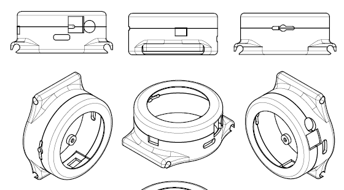

# maelstudiOS 1.0

Logiciel pour une montre intelligente basée sur le XIAO ESP32-S3 Sense dotée d'une caméra, d'un laser, d'un écran tactile et de plein de capteurs.
L'interface est affichée grâce à la bibliothèque graphique [LVGL](https://github.com/lvgl/lvgl) v8.4 et réalisée sur le logiciel [EEZ Studio](https://github.com/eez-open/studio).


## Téléverser le code

Télécharger maelstudiOS. Le fichier Arduino à ouvrir est [maelstudiOS.ino](maelstudiOS/maelstudiOS.ino).
Suivre les étapes pour configurer Arduino IDE pour la carte ESP32-S3 sur le site de [Seeed Studio](https://wiki.seeedstudio.com/xiao_esp32s3_getting_started/#software-preparation).

Ensuite, les bibliothèques suivantes sont à installer:
- [lvgl](https://github.com/lvgl/lvgl) v8.4
- [Seeed GFX](https://github.com/Seeed-Studio/Seeed_GFX)
- I2C_BM8563
- Adafruit_BMP280
- Adafruit_AHT10

Avant de téléverser, activer la PSRAM dans **Tools > PSRAM > OPI PSRAM**. Sinon, le code ne fonctionnera pas.

## Matériel

- Seeed Studio XIAO ESP32S3 Sense
- Seeed Studio XIAO [Round Display](https://wiki.seeedstudio.com/get_start_round_display/)
- Caméra OV2640 (câble de 40 mm)
- Baromètre BMP280
- AHT20 (Thermomètre et humidité)
- Laser 5W 3V (650 nm)
- Moteur à vibration 3V 10x2.7 mm
- 2x Transistor NPN
- 2x Résistance 1 kΩ
- 1x Diode 1N4007
- 2x Batterie 601230 3.7V 180mAh
- Pile CR927
- Interrupteur 3pin SS12D10
- Entretoises et vis M2 ([lien](https://www.aliexpress.com/item/32862529967.html))

Je recommande du fil de cuivre émaillé de 0.3 mm pour les soudures.

## Schéma


## Impression 3D



Imprimé en PLA, le boitier est en deux morceaux: celui du [haut](3d/watch_top.stl) et celui du [bas](3d/watch_bottom.stl).

Téléchargez les STL pour l'imprimer, ou remixez le modèle directement depuis le [projet](https://cad.onshape.com/documents/87cdeb38528e34cc146c01ad/w/1691bc3c81b710f203b58e2a/e/8ebf40c8a169b92a3dbc0f3f?renderMode=0&uiState=6a1e059e983dde0ee30bf48c) Onshape.

## Carte SD

La montre ne démarre pas sans carte SD. Elle doit être insérée dans la carte de l'écran, pas la carte de l'ESP32-S3 Sense Formatter la carte SD au format FAT32 y créer un fichier texte `photos.txt` vide. Le nom de fichier des photos prises seront ajoutées à `photos.txt` pour ne pas avoir à scanner le dossier des photos à chaque fois, ce qui prend du temps. Les photos seront stockées dans la dossier `img`.

## Mods et applis custom

Si vous souhaitez modifier le logiciel pour rajouter vos propres applications, voici la marche à suivre !

D'abord, faire le design de l'interface sur un logiciel graphique tel que Figma. Ensuite, installer le logiciel open source [EEZ Studio](https://www.envox.eu/studio/studio-introduction/) et y ouvrir le projet [maelstudiOS](eez-studio-project/maelstudiOS.eez-project). Ajouter les écrans, les widgets et les événements relatifs à l'application. Pour pouvoir ouvrir l'application, il est nécessaire d'avoir un événement `open_app_...` actionné lors du relâchement d'un bouton sur l'écran d'accueil (icône de l'app). Une fois tous les widgets en place, "Build" le projet avec la clé à molette. Ensuite, copier le contenu du dossier `src` dans le projet Arduino maelstudiOS en écrasant tous les fichiers SAUF `ui.c` et `ui.h`. (j'y ai rajouté une fonction qu'il ne faut pas enlever).

Enfin, pour implémenter une nouvelle application, modifier `maelstudiOS.ino` de la façon suivante:
- Ajouter un élément à l'enum `AppID` ;
- Si l'application requiert l'exécution de code en boucle: ajouter un `case` au `switch(activeApp)` dans le `loop()` ;
- Si l'application requiert du code qui s'exécute à sa fermeture: modifier `closeApp()` ;
- Écrire les fonctions callbacks des événements ajoutés ;
- Ajouter le callback de l'événement `open_app_...` en suivant ce modèle :

```cpp
void action_open_app_...(lv_event_t *e) {
  if (activeApp != HOME) return; // Nécessaire pour empêcher que l'appli s'ouvre lors d'un geste
  // Remplacer par l'identifiant lvgl de l'écran de l'app (consulter screens.h) :
  loadScreenAnim(SCREEN_ID_... LV_SCR_LOAD_ANIM_OVER_BOTTOM, 300);
  activeApp = ...; // Remplacer par l'identifiant de l'app défini dans l'enum `AppID`

  // Ajouter le code à exécuter à l'ouverture de l'app
}
```

**Note**: Pour les boutons, privilégier les events `RELEASE` plutôt que `PRESS` car un event `PRESS` est enregistré quand le doigt de l'utilisateur passe au dessus du widget lors d'un geste (swipe). Cela est problématique si un événement non désiré est enregistré lors d'un swipe vers le haut pour fermer l'application, par exemple. Car on ne peut pas savoir si l'utilisateur est en train d'effectuer un geste ou simplement en train de cliquer. Il est alors préférable d'utiliser `RELEASE` et de vérifier dans la fonction callback si l'application est encore ouverte avec la ligne suivante:
```cpp
if (activeApp != ...) return;
```

Ressources utiles:
- Documentation [LVGL](https://lvgl.io/docs/open/8.4/) v8.4

## Photos


