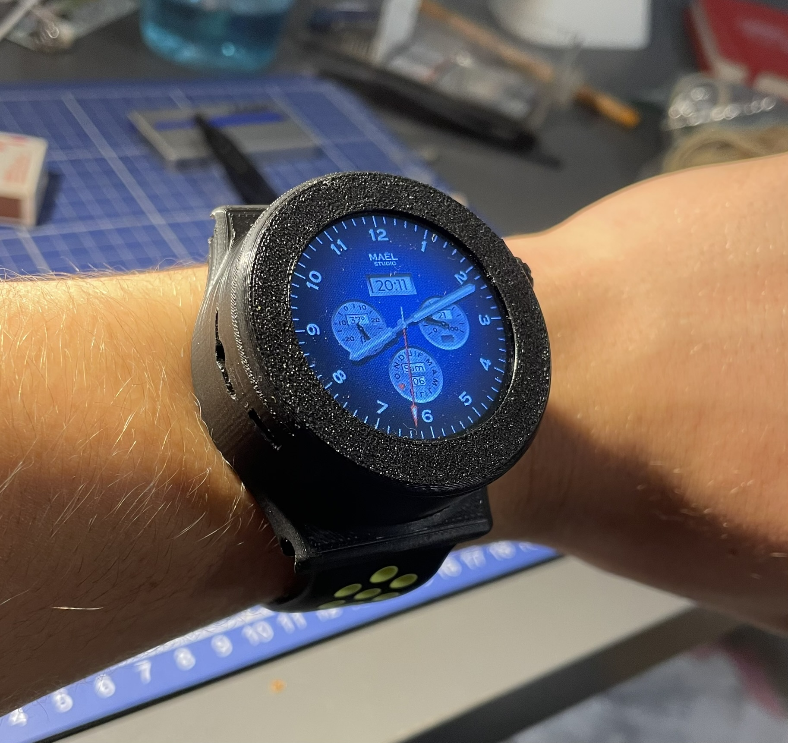

# maelstudiOS

Logiciel pour ma montre intelligente ESP32. En cours de développement!

Bibliothèque graphique utilisée: [LVGL](https://github.com/lvgl/lvgl) v8.4 avec le logiciel [EEZ Studio](https://github.com/eez-open/studio)

## Photos

